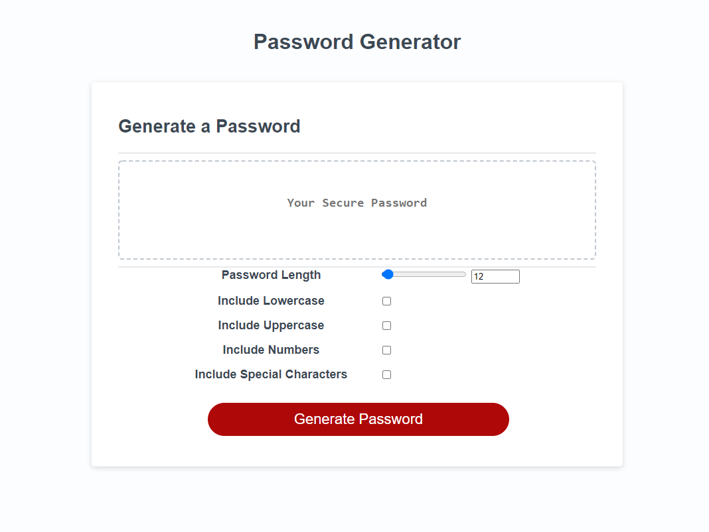

# Challenge3

## Your Task

This week’s Challenge requires you to create an application that an employee can use to generate a random password based on criteria they’ve selected. This app will run in the browser, and will feature dynamically updated HTML and CSS powered by JavaScript code that you write. It will have a clean and polished user interface that is responsive, ensuring that it adapts to multiple screen sizes. This week’s coursework will teach you all the skills you need to succeed in this assignment.

The password can include special characters. If you’re unfamiliar with these, see this list of Password Special Characters from the OWASP Foundation (Links to an external site.).

## User Story
```
AS AN employee with access to sensitive data
I WANT to randomly generate a password that meets certain criteria
SO THAT I can create a strong password that provides greater security
```
## Acceptance Criteria

```
GIVEN I need a new, secure password
WHEN I click the button to generate a password
THEN I am presented with a series of prompts for password criteria
WHEN prompted for password criteria
THEN I select which criteria to include in the password
WHEN prompted for the length of the password
THEN I choose a length of at least 8 characters and no more than 128 characters
WHEN asked for character types to include in the password
THEN I confirm whether or not to include lowercase, uppercase, numeric, and/or special characters
WHEN I answer each prompt
THEN my input should be validated and at least one character type should be selected
WHEN all prompts are answered
THEN a password is generated that matches the selected criteria
WHEN the password is generated
THEN the password is either displayed in an alert or written to the page
```



   Upon clicking the "Generate Password" button you will receive a randomly generated password with only the criteria that you have selected. These inlcude a character length from 8 - 128, Lowercase, Uppercase, Numbers, and Special Characters. If you have not selected any character types you will be prompted with an "alert" asking to to have at least one type selected. With your choices of length and character types made the generate password button will now create a password printed on the page in the center of the password box. I originally started writing arrays that included every single letter, number and character and before I could finish I asked if there was a better, cleaner way of doing this. After some research I found that you could creat an array with the ASCII characters you needed and then call the array when the checkbox was checked. So here we are, I little bit tired, but a lot smarter. 

### Challenge 3 Completed By: Corey Boensch
